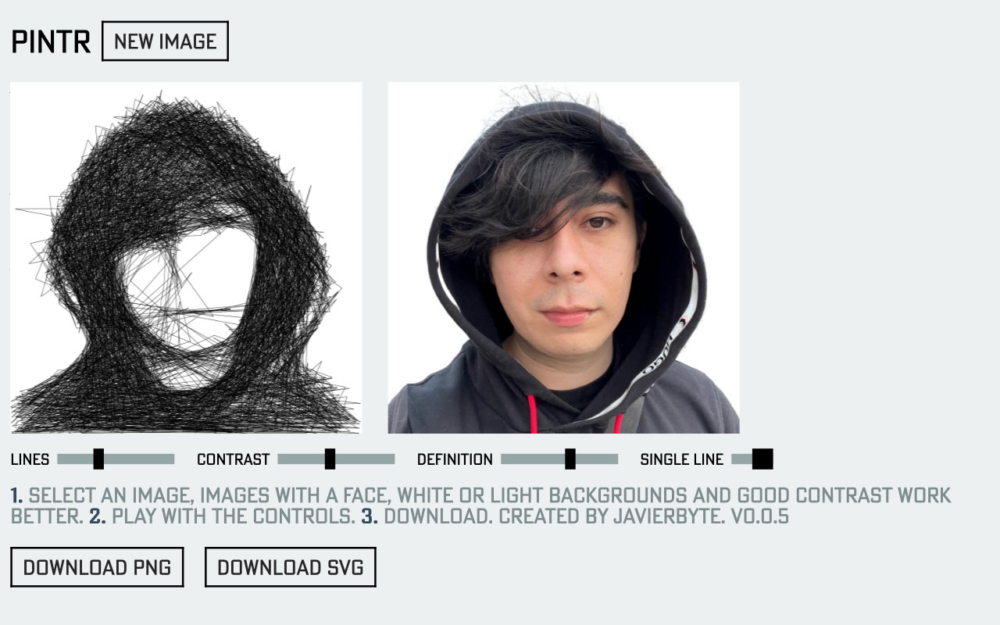
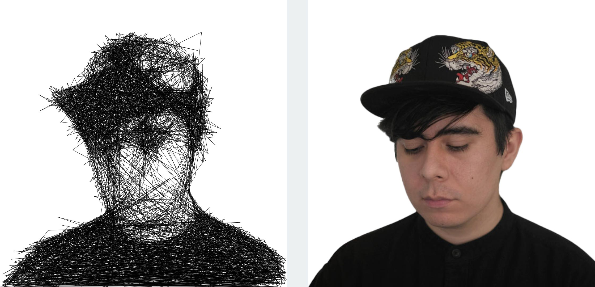
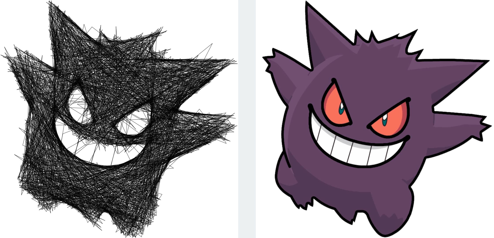
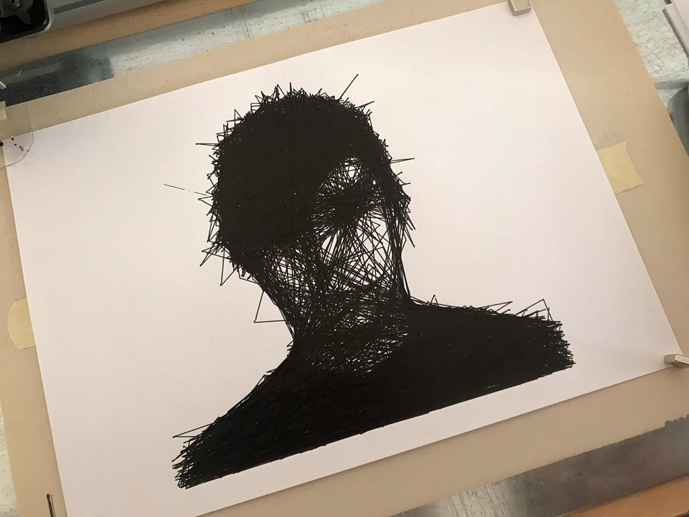

# [Pintr](https://javier.xyz/pintr/)

Create single line SVG illustrations from your pictures.

## Examples

## Plotter Art

Thanks [@sableRaph](https://twitter.com/sableRaph) for helping me create those. Using an AxiDraw.

https://user-images.githubusercontent.com/2009676/119021927-4ba5e000-b9a0-11eb-9ad7-1f9e54e823ae.mp4

### Animated Example

This is an exported SVG animated using [Vivus](https://maxwellito.github.io/vivus-instant/).

## How does it work?

1. The image is normalized for brightness and transformed to grayscale. See [canvasDataToGrayscale](https://github.com/javierbyte/pintr/blob/master/lib/canvasDataToGrayscale.js).
2. A point in the canvas is selected and a line starts looking for different paths to draw next. [See scan functions](https://github.com/javierbyte/pintr/blob/master/transforms/scan.js)
3. Lines are [batched to be drawn](https://github.com/javierbyte/pintr/blob/master/transforms/draw.js) and get flushed almost every frame.
4. Results are exported as svg as a very simple `polyline`, see [generateSvg](https://github.com/javierbyte/pintr/blob/master/transforms/svg.js).

Pixel data and resizing were made using [`canvas-image-utils`](https://github.com/javierbyte/canvas-image-utils), better face definition using [`face-api`](https://github.com/justadudewhohacks/face-api.js/).
